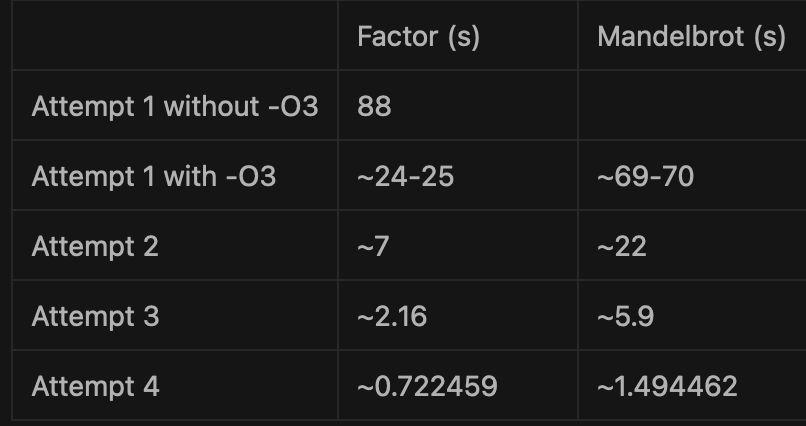

# Brenphuk

NOTE: Currently this project only works on linux x86_64 systems

## What

A brainfuck language interpreter, this project contains 4 implementations of interpreter:

- 1st: simple interpreter, most naive implementation, branch: [attempt_1](https://github.com/feniljain/brenphuk/tree/attempt_1)
- 2nd: Optimization 1: precomputed brackets location, branch: [attempt_2](https://github.com/feniljain/brenphuk/tree/attempt_2)
- 3rd: Optimization 2: combining repeated instructions work, branch: [attempt_3](https://github.com/feniljain/brenphuk/tree/attempt_3)
- 4th: JIT, branch: [attempt_4](https://github.com/feniljain/brenphuk/tree/attempt_4)

## Run

### Deps:

- readline
- meson
- ninja
- dynasm (for `attempt_4`)

### Meson and ninja:

```sh
mkdir build
meson setup build
cd build
meson compile && ./brenphuk
```

To reflect changes in `build` dir changing meson.build/branches:
```sh
meson setup --reconfigure build, to try building after changes
```

NOTE: For `attempt_4` to get dynasm running properly, run `./dynasm_install.sh`, that should setup everything for you :)

When binary is run without any args passed, it by default lands in repl mode. One can run tests using:
```sh
./brenphuk tests
```

Run benchmark using:

```sh
./brenphuk benchmark <number-of-iterations>
```

Run repl explicitly using:

```sh
./brenphuk repl
```

## Benchmark Results

In first case trying to run without -O3 for mandelbrot, took more time than my patience allowed :P



## Output


